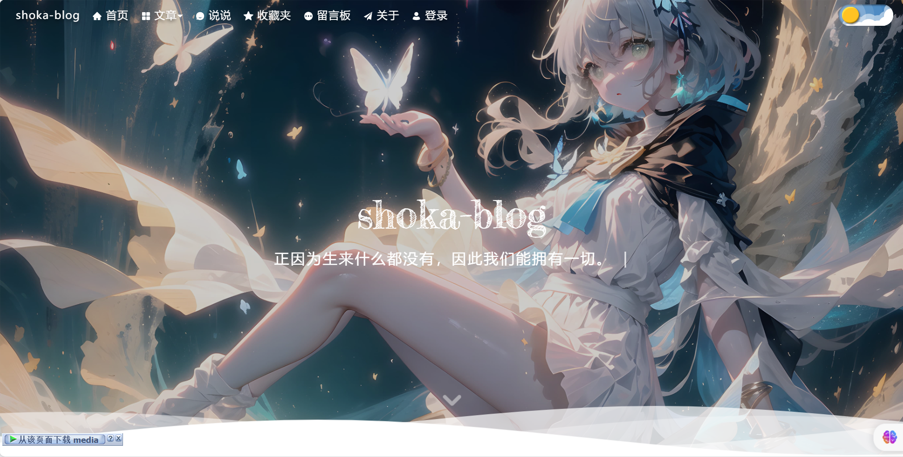
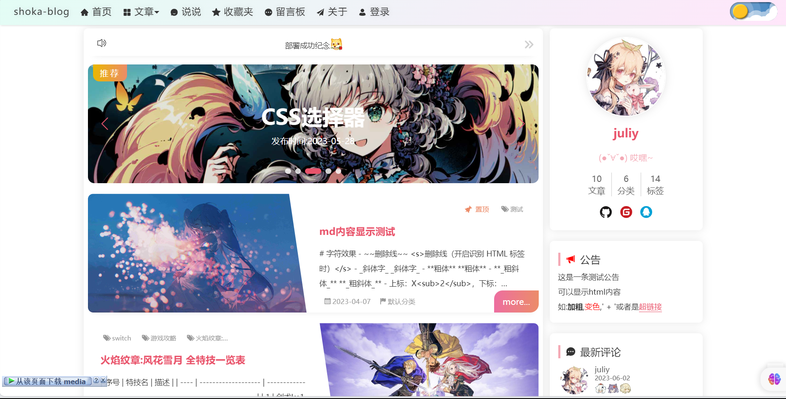
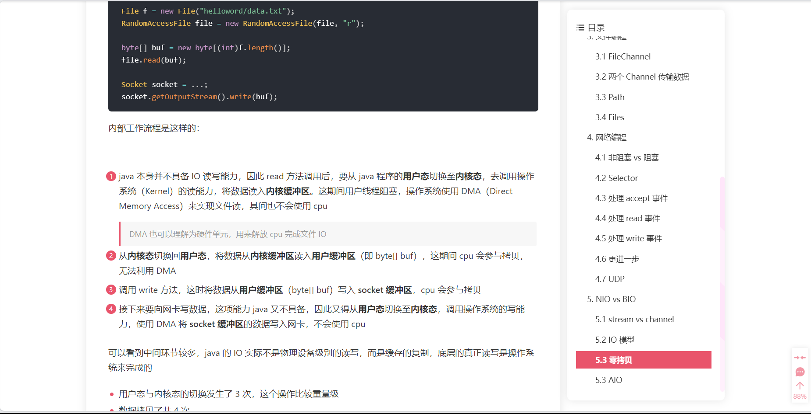
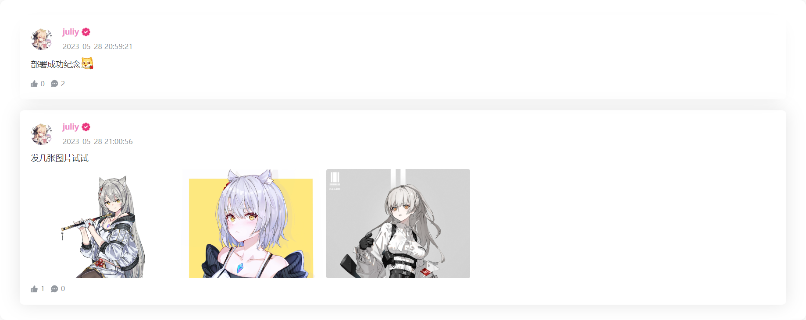
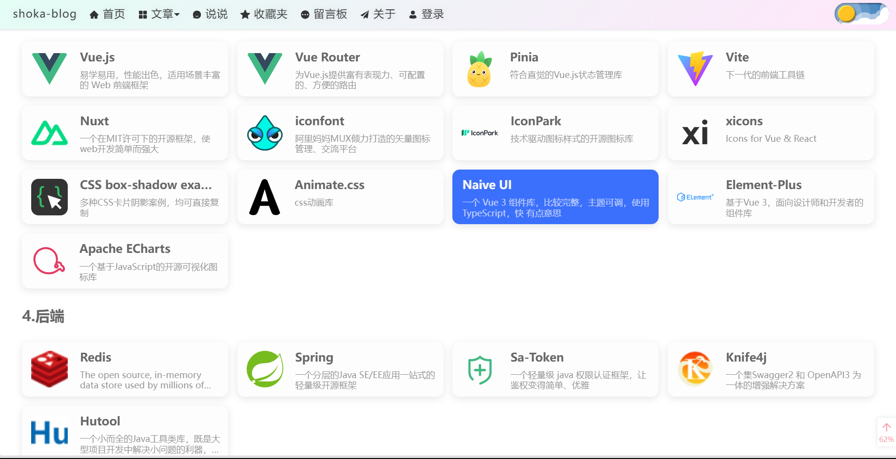

这里是shoka-blog项目的整合仓库

后端: [**shoka-blog-client**](https://github.com/juliy819/shoka-blog-springboot)

后台: [**shoka-blog-admin**](https://github.com/juliy819/shoka-blog-admin)

前台: [**shoka-blog-client**](https://github.com/juliy819/shoka-blog-client)

## 部分页面截图

## 项目地址(服务器过期，已失效)

项目链接： [**https://www.juliy.top**](https://www.juliy.top)

后台链接： [**https://admin.juliy.top**](https://admin.juliy.top)

测试账号： `test@qq.com`，密码：`123456`

接口文档：[**https://admin.juliy.top/doc.html**](https://admin.juliy.top/doc.html)

------------------------------------

## 项目特点

- 前台界面参考 `Hexo` 的 `Shoka` 和 `Butterfly` 设计，响应式布局
- 后台管理基于[**若依管理系统**](https://ruoyi.vip/)二次开发
- 采用 `RABC` 权限模型，使用 `Sa-Token` 进行权限管理
- 支持代码高亮、图片预览、黑夜模式、评论、点赞等功能
- 文章编辑使用 `Markdown` 编辑器

------------------------------------

## 技术栈

前端： `Vue3` + `Vite4` + `Pinia` + `Vue Router` + `TypeScript` + `Axios` + `Element Plus` + `Naive UI` + `Echarts` + `Swiper`
等

后端： `SpringBoot3` + `Mysql` + `Redis` + `Thymeleaf` + `Nginx` + `Sa-Token` + `Swagger3` + `MyBatisPlus` + `RabbitMQ`
（未实装）等

------------------------------------

## 运行环境

服务器：华为云2核2G CentOS 7.9
对象存储：七牛云

------------------------------------

## 开发环境

| 开发工具    | 版本       | 说明               |
|---------|----------|------------------|
| IDEA    | 2023.1.2 | JAVA及VUE开发工具IDE  |
| navicat | 16.0.11  | MYSQL操作工具        |
| tabby   | /        | Linux连接工具，附ftp功能 |

| 开发环境       | 版本     |
|------------|--------|
| OpenJDK    | 17     |
| Redis      | 7.0    |
| vue        | 3.2.47 |
| vite       | 4.2.1  |
| springboot | 3.0.4  |